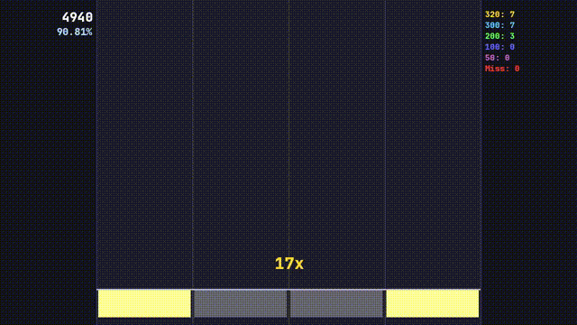

# mania-replay-renderer

A command-line tool that renders osu!mania 4K replays into MP4 videos with audio.

Built from scratch in C++ without using osu!'s source code — parses `.osr` and `.osu` files directly, reconstructs the gameplay frame by frame, and exports via FFmpeg.

## Demo



## Features

- Parses `.osr` replay files and `.osu` beatmap files
- Reconstructs hit/miss judgements from raw input data
- Scroll velocity (SV) support
- Hold note rendering
- Live HUD: score, combo, accuracy, and judgement counters
- MP4 export with audio via FFmpeg pipe
- Real-time preview mode

## Dependencies

- GCC / Clang (C++17)
- CMake + Ninja
- SFML 3.x
- FFmpeg
- liblzma

On Arch Linux:
```bash
sudo pacman -S base-devel cmake ninja sfml ffmpeg xz
```

## Build

```bash
git clone https://github.com/yourusername/mania-replay-renderer
cd mania-replay-renderer
cmake -B build -G Ninja
ninja -C build
```

## Usage

```bash
./build/mania-renderer
```

By default the program looks for:
- `test.osr` — the replay file
- `test.osu` — the beatmap file  
- `assets/audio.mp3` — the song audio
- Outputs to `output.mp4`

> CLI argument support and a graphical file picker are planned for v0.2.

## How it works

| Module | Description |
|---|---|
| `OsrParser` | Reads the binary `.osr` format, decompresses LZMA replay data, extracts keypress frames |
| `OsuParser` | Parses the `.osu` text format, extracts notes, timing points, and scroll velocities |
| `ReplayProcessor` | Crosses keypress timestamps with note timings to assign judgements (320/300/200/100/50/miss) |
| `ScrollCalculator` | Computes per-frame note positions accounting for SV changes |
| `Renderer` | Draws columns, notes, hold bodies, key highlights, and HUD using SFML |
| `FFmpegPipe` | Streams raw RGBA frames to FFmpeg via stdin pipe for H.264 encoding |

## Roadmap

- [ ] CLI arguments for input/output paths
- [ ] Graphical file picker (v0.2)
- [ ] Windows support (v0.3)
- [ ] Skin support
- [ ] Multiple keymodes (7K, 9K)

## Platform

Currently Linux only. Windows support is planned.

## License

MIT
